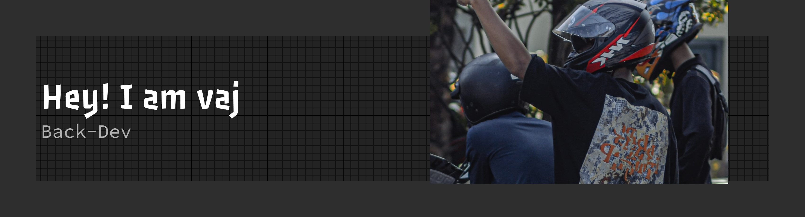

<div align="center">

# 𝙚𝙫_𝙫𝙖𝙟



### Backend Developer • Cloud Enthusiast • System Builder

*"Building systems that work when nobody is watching."*

<br>

[](https://instagram.com/ev_vaj)
[](https://github.com/vansaja06)

</div>

---

## 🕶 About Me

```yaml
Name: Evan Raoul Rahman
Username: ev_vaj
Role: Backend Developer

Education:
  - Software Engineering Student

Focus:
  - Backend Development
  - Cloud Computing
  - System Architecture
  - Database Design
  - REST API Development

Currently Learning:
  - AWS
  - Java Spring Boot
  - React Native
  - DevOps Fundamentals

Goal:
  - Build scalable systems
  - Become a professional backend engineer
```

---

## ⚙ Tech Stack

<div align="center">


</div>

---

## ☁ Cloud & Infrastructure

<div align="center">


</div>

---

## 🚀 Featured Projects

### 🎓 Online Examination System

A web-based examination platform featuring:

- Authentication & Authorization
- Question Bank Management
- Real-time Examination
- Automatic Scoring
- Result Analytics

### ☁ AWS Cloud Infrastructure

Hands-on experience with:

- Amazon EC2
- Auto Scaling Group
- Application Load Balancer
- Amazon RDS
- Amazon S3
- CloudWatch Monitoring

### 💬 Discussion Forum System

Features include:

- Questions & Answers
- User Rating System
- Content Moderation
- Role-Based Access Control

---

## 🎯 Current Mission

```text
[██████████░░░░░░░░] AWS Architecture
[████████████░░░░░░] Backend Engineering
[████████░░░░░░░░░░] Mobile Development
```

---

## 🌙 Philosophy

> "Good software is built twice:
>
> once in the mind,
>
> and once in code."

---

<div align="center">

## 📫 Connect With Me

<a href="https://instagram.com/ev_vaj">
  
</a>

<a href="https://github.com/vansaja06">
  
</a>

</div>