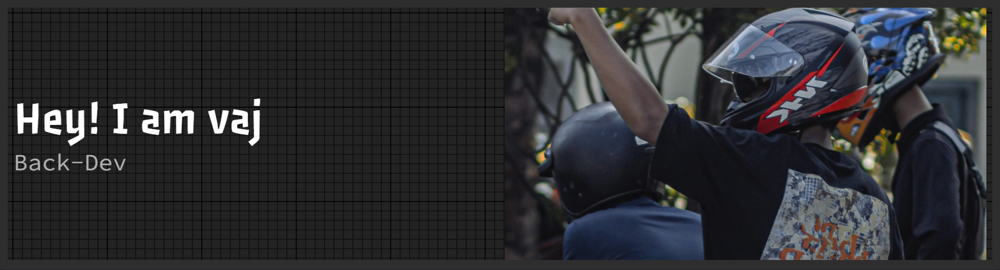

# ev_vaj

### Backend Developer

Building systems that work when nobody is watching.

 

### Information

Software Engineering Student focused on Backend Development,
System Architecture, Database Design, and REST API Development.

 

### Tech Stack

  

### Connect

  

  

